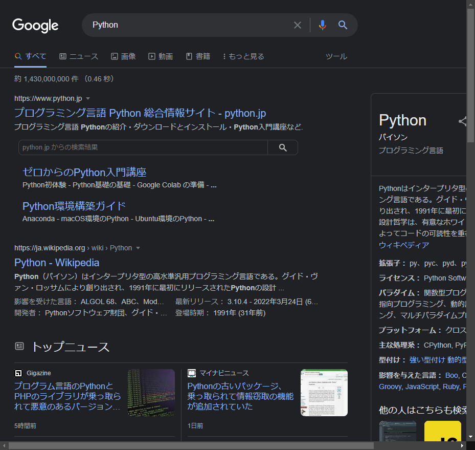

# Python学習キット中級編

- [Python学習キット中級編](#python学習キット中級編)
  - [ライブラリを使用する](#ライブラリを使用する)
    - [モジュールとパッケージ](#モジュールとパッケージ)
    - [ランダムウォークシミュレーション](#ランダムウォークシミュレーション)
  - [標準ライブラリ](#標準ライブラリ)
    - [re](#re)
    - [math](#math)
    - [statistics](#statistics)
    - [itertools](#itertools)
    - [pathlib](#pathlib)
    - [tempfile](#tempfile)
    - [shutil](#shutil)
    - [os](#os)
    - [json](#json)
    - [concurrent.futures](#concurrentfutures)
  - [サードパーティライブラリを使用する](#サードパーティライブラリを使用する)
    - [PyPI](#pypi)
    - [pip](#pip)
    - [よく使用するサードパーティライブラリ](#よく使用するサードパーティライブラリ)
      - [Numpy](#numpy)
      - [Matplotlib](#matplotlib)
      - [Plotly](#plotly)
      - [Pandas](#pandas)
      - [Requests](#requests)
      - [BeautifulSoup4](#beautifulsoup4)
      - [Selenium](#selenium)
      - [OpenPyXL](#openpyxl)
      - [python-pptx](#python-pptx)
      - [PyAutoGUI](#pyautogui)
      - [tlab](#tlab)
    - [その他のライブラリ](#その他のライブラリ)
      - [Pillow](#pillow)
      - [OpenCV](#opencv)
      - [Click](#click)
      - [Django, Flask, FastAPI](#django-flask-fastapi)
      - [TensorFlow, PyTorch](#tensorflow-pytorch)
      - [Streamlit](#streamlit)
  - [タスクを効率化する](#タスクを効率化する)
    - [ファイルの検索](#ファイルの検索)
    - [ファイルのコピー・移動](#ファイルのコピー移動)
    - [zip圧縮](#zip圧縮)
    - [ウェブページを取得](#ウェブページを取得)
    - [HTMLを解析](#htmlを解析)
    - [ブラウザ操作を自動化](#ブラウザ操作を自動化)


<div class="page">

## ライブラリを使用する
### モジュールとパッケージ
プログラムを再利用可能とする仕組みとして「モジュール」というものがある。
Pythonではファイルがそのままモジュールとなる仕組みになっている。
`module.py`というファイルを作れば、それは`module`という名前のモジュールになり、`import module`とインポートすることで別のファイルで`module.py`で定義した関数などを使用することができる。

いくつかのモジュールを一つのディレクトリに集めたものを「パッケージ」という。
Pythonではディレクトリに`__init__.py`というファイルを作成することで、そのディレクトリをパッケージ化することができる。
パッケージをさらに集めてパッケージ化することもできる。


### ランダムウォークシミュレーション
標準ライブラリの一つである`random`モジュールと`math`モジュールを使用して、ランダムウォークをシミュレーションしてみよう。

モジュールを使用するには、`import モジュール名`と記述する。   
モジュールの関数を呼び出すには`モジュール名.関数名()`と記述する。

```python
import random
import math


def random_walk(x=0, y=0, d=1, step=100):
    for _ in range(step):
        theta = 2 * math.pi * random.random()
        x += d * math.cos(theta)
        y += d * math.sin(theta)
    return x, y


if __name__ == "__main__":
    results = [random_walk() for _ in range(100)]
    distances = [math.hypot(x, y) for (x, y) in results]
    avg = sum(distances) / len(distances)
    print("Average:", avg)

```
ソースコードは[random_walk.py](../random_walk.py)にある。
```sh
$ python random_walk.py
Average: 9.349949550243096
```

<div class="page">

## 標準ライブラリ
Pythonは高級な操作を簡単に実現できるように、多くの標準ライブラリが実装されている。

全ての標準ライブラリは[ここ](https://docs.python.org/ja/3.10/library/index.html#library-index)で確認することができる。

その中で、よく使用するライブラリを挙げておく。

### [re](https://docs.python.org/ja/3.10/library/re.html)

正規表現を扱うためのモジュール。

```python
>>> import re
>>> pattern = r"hello, (?=\w+)"
>>> re.match(pattern, "hello, world")
<re.Match object; span=(0, 7), match='hello, '>  # マッチする
>>> re.match(pattern, "hello, ???")              # マッチしない
```

### [math](https://docs.python.org/ja/3.10/library/math.html)

数学関数を集めたモジュール。

```python
>>> import math
>>> math.pi              # 円周率
3.141592653589793
>>> math.floor(math.pi)  # 床関数
3 
>>> math.ceil(math.pi)   # 天井関数
4
>>> math.lcm(3, 4)       # 最小公倍数
12
>>> math.gcd(8, 12)      # 最大公約数
4
>>> math.exp(1)          # 指数関数
2.718281828459045
>>> math.log(1)          # 対数関数
0.0
```

### [statistics](https://docs.python.org/ja/3.10/library/statistics.html)

数理統計関数を集めたモジュール。

```python
>>> import statistics
>>> data = [3, 4, 7, 7, 9, 3, 5, 3]
>>> statistics.mean(data)    # 平均値
5.125
>>> statistics.median(data)  # 中央値
4.5
>>> statistics.mode(data)    # モード
3
>>> statistics.stdev(data)   # 標本標準偏差
2.295181287579947
```

### [itertools](https://docs.python.org/ja/3.10/library/itertools.html)

様々なイテレータを構築する関数を集めたモジュール。

```python
>>> import itertools
>>> list(itertools.accumulate([1, 2, 3, 4, 5]))   # 累積和
[1, 3, 6, 10, 15]
>>> list(itertools.chain("ABC", "DEF"))           # 連鎖
['A', 'B', 'C', 'D', 'E', 'F']
>>> list(itertools.product([1, 2, 3], [4, 5]))    # デカルト積
[(1, 4), (1, 5), (2, 4), (2, 5), (3, 4), (3, 5)]
>>> list(itertools.permutations([1, 3, 5], 2))    # 順列    
[(1, 3), (1, 5), (3, 1), (3, 5), (5, 1), (5, 3)]
>>> list(itertools.combinations([1, 3, 5], 2))    # 組み合わせ 
[(1, 3), (1, 5), (3, 5)]
```

### [pathlib](https://docs.python.org/ja/3.10/library/pathlib.html)

高級なパス操作を行うためのモジュール。

```python
>>> import pathlib
>>> path = pathlib.Path(".")  # Pathオブジェクトの作成
>>> file = path / "monty.py"  # パスの連結
>>> file.exists()             # パスの存在判定
False
>>> # .pyファイルのみをリスト化
>>> [file.name for file in path.iterdir() if file.suffix == ".py"] 
['random_walk.py']
>>> [file.name for file in path.glob("*.py")]
['random_walk.py']
```
他にもパス展開やファイル・ディレクトリの作成・削除などの便利なメソッドがある。


### [tempfile](https://docs.python.org/ja/3.10/library/tempfile.html)

一時ファイルや一時ディレクトリを安全に作成するためのモジュール。

### [shutil](https://docs.python.org/ja/3.10/library/shutil.html)

高級なファイル操作を行う関数を集めたモジュール。


### [os](https://docs.python.org/ja/3.10/library/os.html)

OS依存の機能を利用するためのモジュール。

```python
>>> import os
>>> os.name
'nt'
>>> os.getpid()
31332
```

### [json](https://docs.python.org/ja/3.10/library/json.html)

JSONテキストとPythonオブジェクトを繋ぐモジュール。

```python
>>> import json
>>> alice = {"name": "Alice", "age": 20}
>>> bob = {"name": "Bob", "age": 22}
>>> data = {"person": [alice, bob]}
>>> json.dumps(data)
'{"person": [{"name": "Alice", "age": 20}, {"name": "Bob", "age": 22}]}'
>>> json.loads('{"name": "Charlie", "age": 25}')
{'name': 'Charlie', 'age': 25}
```

### [concurrent.futures](https://docs.python.org/ja/3.10/library/concurrent.futures.html)


並列タスクを実現するためのモジュール。

```python
>>> import concurrent.futures as cf
>>> def task(i):
...     time.sleep(i)
...     return i
...
>>> with cf.ThreadPoolExecutor(max_workers=4) as executor:  # マルチスレッドで処理する
...     futures = [executor.submit(task, i) for i in range(10)]
...     results = [future.result() for future in cf.as_completed(futures)]
... 
>>> print(results)
[0, 2, 1, 3, 6, 5, 4, 7, 9, 8]                              # 結果は一意ではない
```

<div class="page">

## サードパーティライブラリを使用する
### PyPI
Pythonのパッケージはユーザが自由に開発することができて、その多くはPyPI(Python Package Index)で公開されている。

このセクションではPyPIからサードパーティライブラリをインストール・管理する方法を学ぶ。

### pip
PyPIからパッケージをインストールするには`pip`というツールが必要である。
`pip`は通常Pythonをインストールしたときに一緒にインストールされる。

初めに`pip`のバージョンを確認する。
```sh
$ pip --version 
# または
$ python -m pip --version
```

次に`pip`を最新版へ更新する。
```sh
$ pip install --upgrade pip
```

パッケージをインストールするには`pip install パッケージ名`を実行する。  
試しにHTTPリクエストを送るためのパッケージ`requests`をインストールしてみる。

```sh
$ pip install requests
```

現在インストール済みのパッケージを確認する。
```sh
$ pip list
```

パッケージの詳細を確認する。
```sh
$ pip show requests
```

パッケージをアンインストールする。
```sh
$ pip uninstall requests
```

`requirements.txt`ファイルから一括インストールする。
```sh
$ pip install -r requirements.txt
```

バージョンを指定してインストールする。
```sh
$ pip install requests==2.27.1
```

### よく使用するサードパーティライブラリ
知っておいたほうがよいサードパティライブラリをいくつか紹介する。

#### [Numpy](https://numpy.org/)

ベクトルや行列といった、より高度な数学概念を実装したライブラリ。  
中身はBLASで実装されているため、非常に高速に動作し、メモリ効率も良い。

```sh
$ pip install numpy
```
```python
>>> import numpy as np
>>> x = np.array([1, 2, 5, 10])    # 配列を作成 (ベクトルに対応)
>>> 2 * x                          # スカラー演算はブロードキャストされる
array([ 2,  4, 10, 20])
>>> x + 2
array([ 3,  4,  7, 12])
>>> np.exp(x)                      # numpy関数もブロードキャストされる
array([2.71828183e+00, 7.38905610e+00, 1.48413159e+02, 2.20264658e+04])
>>> y = 2 * x
>>> x @ y                          # ドット積
260
>>> x * y                        　# 要素積
array([  2,   8,  50, 200])
>>> np.cross([1, 0, 0], [0, 1, 0]) # クロス積
array([0, 0, 1])
```

#### [Matplotlib](https://matplotlib.org/)

メジャーなグラフ描画ライブラリ。  
2003年発の歴史あるライブラリなので、ノウハウをインターネット上で見つけやすい。

```sh
$ pip install matplotlib
```

```python
>>> import numpy as np
>>> import matplotlib.pyplot as plt
>>> x = np.linspace(0, 2, 100) * np.pi
>>> y = np.sin(x)
>>> fig, ax = plt.subplots()
>>> ax.plot(x, y)              # プロット
[<matplotlib.lines.Line2D object at 0x0000022A953456C0>]
>>> fig.show()                 # グラフを表示
>>> fig.savefig("sin.png")     # 画像として保存
```


GIF画像も作れる。
```python
>>> import matplotlib.animation as anime
>>> fig, ax = plt.subplots()
>>> x = np.linspace(0, 2, 200) * np.pi
>>> t = x
>>> ax.set_xlim(x[0], x[-1])
(0.0, 6.283185307179586)
>>> images = list(map(lambda t: ax.plot(x, np.sin(x - t), c="tab:blue"), t))
>>> animation = anime.ArtistAnimation(fig, images, interval=50)
>>> plt.show()
>>> animation.save("sin_wave.gif")
```


3Dもいける。
```python
>>> import mpl_toolkits.mplot3d
>>> import numpy as np
>>> fig = plt.figure()
>>> ax = fig.add_subplot(111, projection="3d")
>>> t = np.linspace(0, 2, 50) * np.pi
>>> x, y = np.meshgrid(t, t)
>>> ax.set_xlim(t[0], t[-1])
(0.0, 6.283185307179586)
>>> ax.set_ylim(t[0], t[-1])
(0.0, 6.283185307179586)
>>> def update(frame):
...     ax.clear()
...     return ax.plot_surface(x, y, np.sin(x-frame) + np.cos(y-frame))
...
>>> animation = anime.FuncAnimation(fig, update, frames=t, interval=50)
>>> plt.show()
>>> animation.save("3d_wave.gif")
```


#### [Plotly](https://plotly.com/python/)

後発のグラフ描画ライブラリ。  
WEB上で動くインタラクティブなグラフが特徴的で、データ分析アプリケーションのデファクトスタンダードになりつつある。  
[R, Julia, JavaScript, MATLABで動作する](https://plotly.com/graphing-libraries/)ため、データサイエンティストをメインターゲットにしていることが伺える。

```sh
$ pip install plotly
```

```python
>>> import plotly.express as px
>>> import numpy as np
>>> x = np.linspace(0, 2 * np.pi, 100)
>>> fig = px.line(x=x, y=np.sin(x))
>>> fig.show()
>>> fig.write_image("plotly_sin.png")
```
<iframe src="../images/plotly_sin.html" width=640 height=480 frameborder="no"></iframe>

散布図を描く。
```python
>>> df = px.data.iris()
>>> fig = px.scatter(df, x="sepal_length", y="sepal_width", color="species")
>>> fig.show()
```
<iframe src="../images/plotly_scatter.html" width=640 height=480 frameborder="no"></iframe>

```python
>>> fig = px.scatter_3d(df, x="sepal_length", y="sepal_width", z="petal_width", color="species")
>>> fig.show()
```

<iframe src="../images/plotly_scatter_3d.html" width=640 height=480 frameborder="no"></iframe>


#### [Pandas](https://pandas.pydata.org)

データフレームライブラリ。  
CSVやExcelのような表データを「データフレーム」として扱う。
主にデータ分析に用いる。

```python
>>> import pandas as pd
>>> iris_csv = """https://gist.github.com/netj/8836201\
... /raw/6f9306ad21398ea43cba4f7d537619d0e07d5ae3/iris.csv"""
>>> df = pd.read_csv(iris_csv)
>>> df.head()
   sepal.length  sepal.width  petal.length  petal.width variety
0           5.1          3.5           1.4          0.2  Setosa       
1           4.9          3.0           1.4          0.2  Setosa       
2           4.7          3.2           1.3          0.2  Setosa       
3           4.6          3.1           1.5          0.2  Setosa       
4           5.0          3.6           1.4          0.2  Setosa
>>> df.describe()
       sepal.length  sepal.width  petal.length  petal.width
count    150.000000   150.000000    150.000000   150.000000
mean       5.843333     3.057333      3.758000     1.199333
std        0.828066     0.435866      1.765298     0.762238
min        4.300000     2.000000      1.000000     0.100000
25%        5.100000     2.800000      1.600000     0.300000
50%        5.800000     3.000000      4.350000     1.300000
75%        6.400000     3.300000      5.100000     1.800000
max        7.900000     4.400000      6.900000     2.500000
```

#### [Requests](https://requests.readthedocs.io)

HTTP（Hyper Text Transfer Protocol)の人間向きインターフェースを実装したライブラリ。  
HTTPには様々なメソッドが存在するが、我々がよく使用するのはGETメソッドとPOSTメソッドである。

- GET: ウェブサーバーからデータを取得する
- POST: ウェブサーバーにデータを送信する

See Also

- [https://developer.mozilla.org/ja/docs/Web/HTTP/Methods](https://developer.mozilla.org/ja/docs/Web/HTTP/Methods)
- [https://developer.mozilla.org/ja/docs/Web/HTTP/Status](https://developer.mozilla.org/ja/docs/Web/HTTP/Status)

```sh
$ pip intall requests
```

```python
>>> import requests
>>> url = "https://google.com"
>>> response = requests.get(url)                   # GETメソッドを実行
>>> response.status_code                           # ステータスコードの取得
200
>>> response.raise_for_status()                    # 404 Not Found等で例外が送出される

>>> response.content                               # 取得したバイトデータ
# 省略
>>> response.text                                  # 取得したテキストデータ   
# 省略
```

#### [BeautifulSoup4](https://www.crummy.com/software/BeautifulSoup/bs4/)

HTML(Hyper Text Markup Language)を解析するライブラリ。  
HTMLテキストから任意の情報を簡単に抽出することができる。

ブラウザでリンクとして表示されているのは`<a>`タグ要素である。

See Also

- [https://developer.mozilla.org/ja/docs/Web/HTML/Element](https://developer.mozilla.org/ja/docs/Web/HTML/Element)

```sh
$ pip install beautifulsoup4
```

```python
>>> import bs4
>>> import requests
>>> url = "https://google.com"
>>> response = requests.get(url)
>>> soup = bs4.BeautifulSoup(response.content, "html.parser")
>>> tag = soup.find("a")              # <a>タグを検索
>>> tag
<a class="gb1" href="https://www.google.co.jp/imghp?hl=ja&amp;tab=wi">画像</a>
>>> tag.text                          # タグのテキストを取得
'画像'
>>> tag.get("href")                   # タグの属性を取得
'https://www.google.co.jp/imghp?hl=ja&tab=wi'
>>> for tag in soup.find_all("a"):    # <a>タグを全て検索
...     print(tag)
... 
<a class="gb1" href="https://www.google.co.jp/imghp?hl=ja&amp;tab=wi">画像</a>
<a class="gb1" href="https://maps.google.co.jp/maps?hl=ja&amp;tab=wl">マップ</a>
<a class="gb1" href="https://play.google.com/?hl=ja&amp;tab=w8">Play</a>
<a class="gb1" href="https://www.youtube.com/?gl=JP&amp;tab=w1">YouTube</a>
<a class="gb1" href="https://news.google.com/?tab=wn">ニュース</a>
<a class="gb1" href="https://mail.google.com/mail/?tab=wm">Gmail</a>
<a class="gb1" href="https://drive.google.com/?tab=wo">ドライブ</a>
<a class="gb1" href="https://www.google.co.jp/intl/ja/about/products?tab=wh" style="text-decoration:none"><u>もっと見る</u> »</a>
<a class="gb4" href="http://www.google.co.jp/history/optout?hl=ja">ウェブ履歴</a>
<a class="gb4" href="/preferences?hl=ja">設定</a>
<a class="gb4" href="https://accounts.google.com/ServiceLogin?hl=ja&amp;passive=true&amp;continue=https://www.google.com/&amp;ec=GAZAAQ" id="gb_70" target="_top">ログイン</a>        
<a href="/advanced_search?hl=ja&amp;authuser=0">検索オプション</a>
<a href="http://www.google.co.jp/intl/ja/services/">ビジネス ソリューション</a>
<a href="/intl/ja/about.html">Google について</a>
<a href="https://www.google.com/setprefdomain?prefdom=JP&amp;prev=https://www.google.co.jp/&amp;sig=K_FkxzWFTT-3CO0HCQCDUYHqsaspo%3D">Google.co.jp</a>
<a href="/intl/ja/policies/privacy/">プライバシー</a>
<a href="/intl/ja/policies/terms/">規約</a>
```


#### [Selenium](https://www.selenium.dev)

ブラウザを操作するためのライブラリ。  
元々はブラウザテストを自動化するためにJavaで実装されたライブラリである。  
使いこなせればブラウザ作業は全てプログラムで自動化できるようになる。

以下ではGoogle Chrome/Chromiumブラウザを操作する例を示す。

```sh
$ pip install selenium chromedriver-binary-auto
```

Googleで「Python」と検索してスクリーンショットを保存する。
```python
>>> import selenium.webdriver as wd
>>> from selenium.webdriver.common.by import By
>>> from selenium.webdriver.common.keys import Keys
>>> import chromedriver_binary
>>> options = wd.ChromeOptions()
>>> driver = wd.Chrome(options=options)
>>> search_box = driver.find_element(By.NAME, "q")
>>> search_box.send_keys("Python")
>>> search_box.send_keys(Keys.RETURN)       
>>> driver.save_screenshot("selenium.png")
True
>>> driver.quit()   # 終了するときは必ず呼び出す（メモリリークの原因になる）
```



#### [OpenPyXL](https://openpyxl.readthedocs.io)

ExcelファイルをPythonで操作するためのライブラリ。

```sh
$ pip install openpyxl
```
ワークブックへの書き込み。
```python
>>> import openpyxl
>>> wb = openpyxl.Workbook()             # ワークブックを作成
>>> ws = wb.active                       # アクティブなシートを取得
>>> ws["A1"] = 42                        # セルに値を入力
>>> ws.append([1, 2, 3])                 # 行を追加
>>> ws.title = "Title here"              # シートタイトルを更新
>>> ws2 = wb.create_sheet(title="Data")  # 新しいシートを作成
>>> wb.save("openpyxl.xlsx")             # ワークブックを保存
```
ワークブックの読み込み。
```python
>>> # ワークブックのロード
>>> wb = openpyxl.load_workbook("openpyxl.xlsx") 
>>> wb.sheetnames                        # シート名を取得
['Title here', 'Data']
>>> ws = wb["Title here"]                # シートを取得
>>> ws["A1"].value                       # セルの値を取得
42
```

#### [python-pptx](https://python-pptx.readthedocs.io/en/latest/)

PowerPointファイルを作成・編集するためのライブラリ。

```sh
$ pip install python-pptx
```

```python
>>> import pptx
>>> prs = pptx.Presentation()                         # プレゼンテーションを作成
>>> title_slide_layout = prs.slide_layouts[0]         # レイアウトを取得
>>> slide = prs.slides.add_slide(title_slide_layout)  # スライドを追加
>>> title = slide.shapes.title                        # タイトルボックスを取得
>>> subtitle = slide.placeholders[1]                  # サブタイトルボックスを取得
>>> title.text = "Hello, World!"                      # タイトルを更新
>>> subtitle.text = "python-pptx was here!"           # サブタイトルを更新
>>> prs.save("python-pptx.pptx")                      # プレゼンテーションを保存
```

#### [PyAutoGUI](https://pyautogui.readthedocs.io/en/latest/index.html)

GUIを自動化するためのライブラリ。  
マウス操作やキー入力操作を自動化できる。

```sh
$ pip install pyautogui
```

```python
>>> import pyautogui
>>> pyautogui.position()
Point(x=1435, y=974)
>>> pyautogui.moveTo(100, 150)   　　　　　# マウスを絶対座標へ移動
>>> pyautogui.move(100, 300, duration=2)  # 2秒かけてマウスを絶対座標へ移動
>>> pyautogui.move(100, 150)              # マウスを相対座標へ移動
>>> pyautogui.click()                     # マウスをクリック
>>> pyautogui.doubleClick()               # マウスをダブルクリック
>>> pyautogui.write("print('Hello')")     # 文字を入力
>>> print('Hello')
Hello
>>> pyautogui.press("Win")                # キーを入力
>>> pyautogui.hotkey("Win", "d")          # ホットキーを入力
>>> with pyautogui.hold("shift"):         # キーをホールド
...     pyautogui.hotkey("Win", "s")
...
```

#### [tlab](https://github.com/huisint/tlab)

筆者が開発している研究室用のライブラリ。  
現在(2022/05/26)は[GitHub](https://github.com/huisint/tlab)からのみインストール可能である。

```sh
$ pip install git+https://github.com/huisint/tlab
```

GoogleのAPIを使用する。
APIはWasedaアカウントでなければ使用できない。
```python
>>> from tlab import google
>>> creds = google.Credentials.new()                     # 認証情報の取得
>>> api = google.GmailAPI(creds)                         # GmailAPIインスタンスの作成
>>> query = 'subject:("Laboratory Seminar Invitation")'  # Gmailの検索ボックスと同じフォーマットのクエリ
>>> api.search_email(query)                              # メールを検索
# 省略
>>> gmail = api.get_email("180ff484260f064b")            # メールを取得
>>> for header in gmail["payload"]["headers"]:
...     if header["name"] == "Subject":
...             print(header["value"])
... 
Laboratory Seminar Invitation
```

### その他のライブラリ
より高度なアプリケーションのためのライブラリを挙げる。

#### [Pillow](https://python-pptx.readthedocs.io/en/latest/)

画像処理ライブラリ。

```sh
$ pip install pillow
```

```python
>>> from PIL import Image
>>> im = Image.open("images/sin.png")    # 画像の読み込み
>>> im.show()                            # 画像の表示
>>> im.size                              # 画像サイズの取得
(640, 480)
>>> im.resize((320, 480)).show()         # リサイズ
>>> im.rotate(90).show()                 # 回転
>>> im.save("pillow.png")                # 保存
```

#### [OpenCV](https://github.com/skvark/opencv-python)

より高度な画像処理ライブラリ。  
画像処理分野の研究成果が実装されている。

```sh
$ pip install opencv-python
```

#### [Click](https://palletsprojects.com/p/click/)

コマンドラインインターフェース(CLI)を作るためのライブラリ。  
標準ライブラリでもCLIを作ることはできるが、メンテナンス性が良いのでこのライブラリを使用することを推奨する。

```sh
$ pip install click
```


#### Django, Flask, FastAPI
[Django](https://docs.djangoproject.com/en/4.0/ )  
[Flask](https://flask.palletsprojects.com/en/2.1.x/)  
[FastAPI](https://fastapi.tiangolo.com/)

ウェブアプリケーションフレームワークライブラリ。  
Pythonでウェブアプリケーションを作る場合にどれかにお世話になるだろう。
おすすめはFastAPIである。

```shell
$ pip install django
$ pip install flask
$ pip install fastapi
```


#### TensorFlow, PyTorch
[TensorFlow](https://www.tensorflow.org/)  
[PyTorch](https://pytorch.org/docs/stable/index.html)

機械学習ライブラリ。  
機械学習研究者の研究成果が詰め込まれている。

数年前の流行りのおかげで、ノウハウや書籍が充実している。
一応、機械学習の理論を知らなくても使えるように実装されているが、ニューラルネットワークの基礎的な理論は学習しておいたほうが良いかもしれない。

```shell
$ pip install tensorflow
$ pip install pytorch
```

#### [Streamlit](https://streamlit.io/)

データ分析に特化したウェブアプリケーションを作れるライブラリ。  
簡単なAPIでモダンなウェブアプリを作ることができる。

```sh
$ pip install streamlit
```

<div class="page">

## タスクを効率化する
紹介したライブラリを使用して自身のタスクを効率化する例を示す。

### [ファイルの検索](app_examples/search_files.py)
カレントディレクトリ以下に眠るPythonソースファイル`.py`を検索して、そのパスをコンソール出力してみよう。

```python
import pathlib

dirctory = pathlib.Path.cwd()
suffix = ".py"


for file in dirctory.glob(f"**/*{suffix}"):
    print(file)

```

### [ファイルのコピー・移動](app_examples/move_files.py)
特定のキーワードをファイル名に含むファイルを検索して、一つのフォルダに集めてみよう。


```python
import pathlib
import shutil

directory = pathlib.Path("//192.168.0.10/disk/references")
destination = pathlib.Path.cwd() / "dest"
keywords = ["In", "量子ドット"]


destination.mkdir(parents=True, exist_ok=True)
for file in directory.glob("**/*"):
    if file.is_dir():
        continue
    if all((keyword in file.name) for keyword in keywords):
        shutil.copy(file, destination)

```


### [zip圧縮](app_examples/zip.py)
zipアーカイブを作ってみよう。

```python
import pathlib
import shutil

directory = pathlib.Path.cwd() / "data"

shutil.make_archive(directory.name, format="zip", root_dir=directory)

```


### [ウェブページを取得](app_examples/save_webpage.py)
ウェブからデータを取得して任意のディレクトリに保存しよう。

HTMLテキストはもちろん、zipファイルや画像データといったバイナリも取得して保存できる。
```python
import pathlib
import requests

savedir = pathlib.Path.cwd() / "webpages"
urls = []


savedir.mkdir(parents=True, exist_ok=True)
for url in urls:
    response = requests.get(url)
    response.raise_for_status()
    filename = response.url.split("/")[-1]
    with open(savedir / filename, mode="wb") as f:
        f.write(response.content)

```

### [HTMLを解析](app_examples/analyze_webpage.py)
ウェブからHTMLテキストを取得して解析してみよう。
独自のスクリプトを作成する際はChromeのDevTools(f12)のElementタブが便利だ。

過去の応用物理学会講演会からキーワードに合致した講演タイトルを出力する。
```python
import requests
import bs4

keywords = ["Ga", "量子ドット"]
url_base = "https://confit.atlas.jp"
programs = {
    "2021年 第82回応用物理学会秋季学術講演会（オンライン）": url_base + "/guide/event/jsap2021a/class",
    "2021年 第68回応用物理学会春季学術講演会（オンライン）": url_base + "/guide/event/jsap2021s/class",
}


headers = {"Accept-Language": "ja"}
for program, url in programs.items():
    print(program)
    response = requests.get(url, headers=headers)
    response.raise_for_status()
    soup = bs4.BeautifulSoup(response.content, "html.parser")
    dl_tag = soup.find("dl", attrs={"class": "cmn-dl"})
    if dl_tag is None:
        continue
    session_urls = [
        url_base + tag.get("href") for tag in dl_tag.find_all("a")
        if isinstance(tag, bs4.Tag)
    ]
    for session_url in session_urls:
        _response = requests.get(session_url, headers=headers)
        _response.raise_for_status()
        _soup = bs4.BeautifulSoup(_response.content, "html.parser")
        title_tags = [
            tag.find("a") for tag in _soup.find_all("h1", attrs={"title": "講演名"})
            if isinstance(tag, bs4.Tag)
        ]
        for tag in title_tags:
            if all((keyword in tag.text) for keyword in keywords):
                print(tag.text)
                print(url_base + tag.get("href"))
    print()

```
HTTPリクエストは処理に時間がかかるため、このスクリプトは実行に時間がかかる。
これをマルチスレッド化して高速化してみよう。


### [ブラウザ操作を自動化](app_examples/automate_browser.py)
Pythonでブラウザを操作してみよう。

ブラウザを通してGoogleの検索機能を使い、検索結果をコンソール出力する。
```python
import selenium.webdriver as wd
from selenium.webdriver.common import by, keys
from selenium.common import exceptions
import chromedriver_binary  # noqa

query = "waseda university"


options = wd.ChromeOptions()
options.add_experimental_option("excludeSwitches", ["enable-logging"])
options.add_argument("--headless")  # ヘッドレスモード
driver = wd.Chrome(options=options)
driver.implicitly_wait(1)
try:
    driver.get("https://google.com")
    search_box = driver.find_element(by.By.NAME, "q")
    search_box.send_keys(query)
    search_box.send_keys(keys.Keys.RETURN)
    search = driver.find_element(by.By.ID, "search")
    for a in search.find_elements(by.By.TAG_NAME, "a"):
        try:
            h3 = a.find_element(by.By.TAG_NAME, "h3")
            print(h3.text, a.get_attribute("href"))
        except exceptions.NoSuchElementException:
            continue
finally:
    driver.quit()

```


Copyright (c) 2022 Shuhei Nitta. All rights reserved.